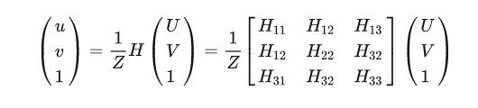
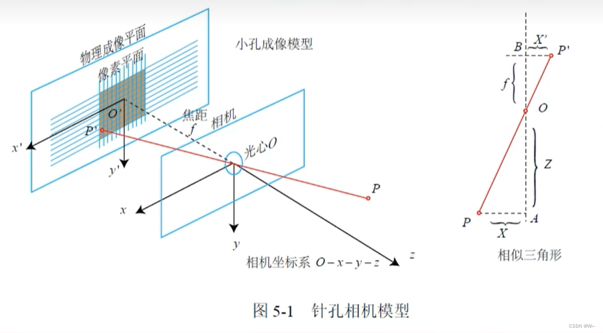
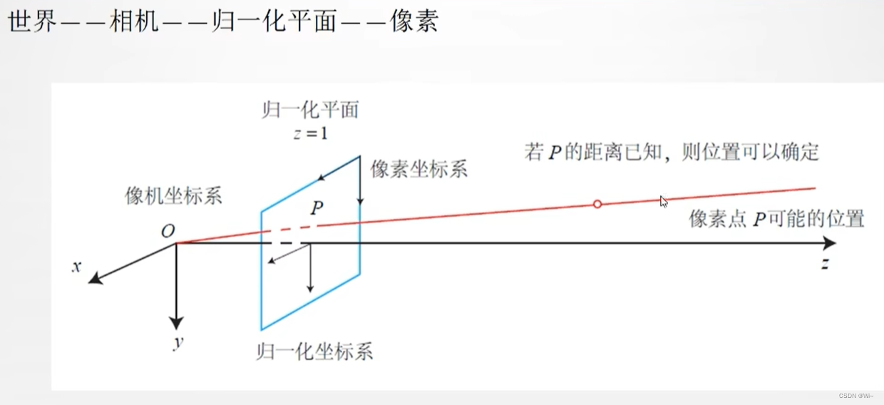
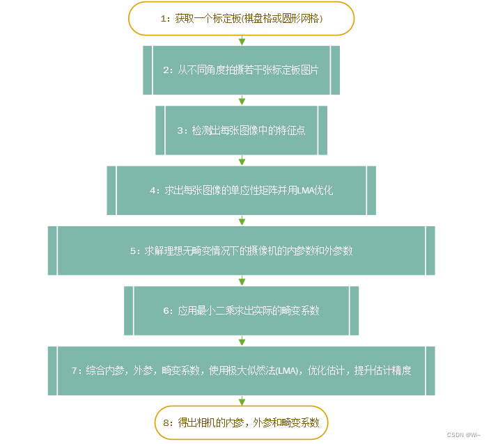

## 单目相机标定  

坐标变换：
世界坐标系->相机坐标系->图像坐标系->像素坐标系


其中，f为像距，dX,dY分别表示X，Y方向上的一个像素在相机感光板上的物理长度（即一个像素在感光板上是多少毫米）， u0,v0分别表示相机感光板中心在像素坐标系下的坐标，theta表示感光板的横边和纵边之间的角度（90度表示无误差）。

内参矩阵与外参矩阵的乘积构成单映矩阵H(H1,H2,H3)。



此时，尺度因子Z已经被消去，因此上式对于同一张图片上所有的角点均成立。 (u,v)是像素坐标系下的标定板角点的坐标，(U,V)是世界坐标系下的标定板角点的坐标。通过图像识别算法，我们可以得到标定板角点的像素坐标(u,v)，又由于标定板的世界坐标系是人为定义好的，标定板上每一个格子的大小是已知的，我们可以计算得到世界坐标系下的(U,V)。

由这里的H是齐次矩阵，有8个独立未知元素。每一个标定板角点可以提供两个约束方程（u,U,V的对应关系、v,U,V的对应关系提供了两个约束方程），因此，**当一张图片上的标定板角点数量等于4时，即可求得该图片对应的矩阵H**  。当一张图片上的标定板角点数量大于4时，利用最小二乘法回归最佳的矩阵H。

那么就可以在相机坐标系下，设P坐标(X,Y,Z)和P的投影点P'(x',y',z')。值得一提的是，P'(x',y',z')坐落在物理成像平面和像素平面。

**物理成像平面**，像素平面是二维的，他们的坐标系并不一样：
物理成像平面在 O'(x',y')平面上；
像素平面的原点在那个黑灰色图的左上角(图片的左上角)，横轴向右称为u轴，纵轴向下称为v轴。
这样就得到了P'的像素坐标P(u,v)，称为Puv。



在使用过程中会引入**归一化坐标系**



计算流程



**内参求解**https://zhuanlan.zhihu.com/p/94244568

https://blog.csdn.net/weixin_43763292/article/details/128546103?csdn_share_tail=%7B%22type%22%3A%22blog%22%2C%22rType%22%3A%22article%22%2C%22rId%22%3A%22128546103%22%2C%22source%22%3A%22weixin_43763292%22%7D


## 双目标定（对极几何）

https://blog.csdn.net/h1527820835/article/details/124366040

https://blog.csdn.net/hejingkui/article/details/80488763

立体校正的时候需要两幅图像共面并且行对准 以使得立体匹配更加的可靠
 使得两幅图像共面的方法就是把两个摄像头的图像投影到一个公共成像面上，这样每幅图像从本图像平面投影到公共图像平面都需要一个旋转矩阵R
 stereoRectify 这个函数计算的就是从图像平面投影到公共成像平面的旋转矩阵Rl,Rr。 Rl,Rr即为左右相机平面行对准的校正旋转矩阵。
 左相机经过Rl旋转，右相机经过Rr旋转之后，两幅图像就已经共面并且行对准了。
 其中Pl,Pr为两个相机的投影矩阵，其作用是将3D点的坐标转换到图像的2D点的坐标:P*[X Y Z 1]' =[x y w]
 Q矩阵为重投影矩阵，即矩阵Q可以把2维平面(图像平面)上的点投影到3维空间的点:Q*[x y d 1] = [X Y Z W]。其中d为左右两幅图像的时差 

****

****

## 立体匹配

难点：1、光学失真和噪声；

2、平面光滑的镜面反射；

3、弱纹理区域。

步骤：

1、输入时矫正后的图片；

图像预处理：

两种立体匹配算法都要先对输入图像做预处理，OpenCV源码中中调用函数 static void prefilterXSobel(const cv::Mat& src, cv::Mat& dst, int preFilterCap)，参数设置中preFilterCap在此函数中用到。

函数步骤如下，作用主要有两点：

1）、对于无纹理区域，能够排除噪声干扰；

2）、对于边界区域，能够提高边界的区分性，利于后续的匹配代价计算。

a、先利用水平Sobel算子求输入图像x方向的微分值Value；

b、如果Value<-preFilterCap, 则Value=0;

如果Value>preFilterCap,则Value=2*preFilterCap;

如果Value>=-preFilterCap &&Value<=preFilterCap,则Value=Value+preFilterCap;

c、输出处理后的图像作为下一步计算匹配代价的输入图像。

```c++
static void prefilterXSobel(const cv::Mat& src, cv::Mat& dst, int ftzero)
{
    int x, y;
    const int OFS = 256 * 4, TABSZ = OFS * 2 + 256;
    uchar tab[TABSZ];
    cv::Size size = src.size();

    for (x = 0; x < TABSZ; x++)
        tab[x] = (uchar)(x - OFS < -ftzero ? 0 : x - OFS > ftzero ? ftzero * 2 : x - OFS + ftzero);
    uchar val0 = tab[0 + OFS];

    for (y = 0; y < size.height - 1; y += 2)
    {
        const uchar* srow1 = src.ptr<uchar>(y);
        const uchar* srow0 = y > 0 ? srow1 - src.step : size.height > 1 ? srow1 + src.step : srow1;
        const uchar* srow2 = y < size.height - 1 ? srow1 + src.step : size.height > 1 ? srow1 - src.step : srow1;
        const uchar* srow3 = y < size.height - 2 ? srow1 + src.step * 2 : srow1;
        uchar* dptr0 = dst.ptr<uchar>(y);
        uchar* dptr1 = dptr0 + dst.step;

        dptr0[0] = dptr0[size.width - 1] = dptr1[0] = dptr1[size.width - 1] = val0;
        x = 1;
        for (; x < size.width - 1; x++)
        {
            int d0 = srow0[x + 1] - srow0[x - 1], d1 = srow1[x + 1] - srow1[x - 1],
                d2 = srow2[x + 1] - srow2[x - 1], d3 = srow3[x + 1] - srow3[x - 1];
            int v0 = tab[d0 + d1 * 2 + d2 + OFS];
            int v1 = tab[d1 + d2 * 2 + d3 + OFS];
            dptr0[x] = (uchar)v0;
            dptr1[x] = (uchar)v1;
        }
    }

    for (; y < size.height; y++)
    {
        uchar* dptr = dst.ptr<uchar>(y);
        x = 0;
        for (; x < size.width; x++)
            dptr[x] = val0;
    }
}
```

```c++
void mySobelX(cv::Mat srcImg, cv::Mat dstImg, int preFilterCap)
{
    assert(srcImg.channels() == 1);
    int radius = 1;
    int width = srcImg.cols;
    int height = srcImg.rows;
    uchar *pSrcData = srcImg.data;
    uchar *pDstData = dstImg.data;
    for (int i = 0; i < height; i++)
    {
        for (int j = 0; j < width; j++)
        {
            int idx = i*width + j;
            if (i >= radius && i < height - radius && j >= radius && j < width - radius)
            {
                int diff0 = pSrcData[(i - 1)*width + j + 1] - pSrcData[(i - 1)*width + j - 1];
                int diff1 = pSrcData[i*width + j + 1] - pSrcData[i*width + j - 1];
                int diff2 = pSrcData[(i + 1)*width + j + 1] - pSrcData[(i + 1)*width + j - 1];

                int value = diff0 + 2 * diff1 + diff2;
                if (value < -preFilterCap)
                {
                    pDstData[idx] = 0;
                }
                else if (value >= -preFilterCap && value <= preFilterCap)
                {
                    pDstData[idx] = uchar(value + preFilterCap);
                }
                else
                {
                    pDstData[idx] = uchar(2 * preFilterCap);
                }

            }
            else
            {
                pDstData[idx] = 0;
            }
        }
    }
}
```

2、代价聚合；

3、视差计算；

4、视差优化。

filterSpeckles() 视差图后处理

两种立体匹配算法在算出初始视差图后会进行视差图后处理，包括中值滤波，连通域检测等。其中中值滤波能够有效去除视差图中孤立的噪点，而连通域检测能够检测出视差图中因噪声引起小团块(blob)。在BM和SGBM中都有speckleWindowSize和speckleRange这两个参数，speckleWindowSize是指设置检测出的连通域中像素点个数，也就是连通域的大小。speckleRange是指设置判断两个点是否属于同一个连通域的阈值条件。大概流程如下：

1）、判断当前像素点四邻域的邻域点与当前像素点的差值diff，如果diff<speckRange，则表示该邻域点与当前像素点是一个连通域，设置一个标记。然后再以该邻域点为中心判断其四邻域点，步骤同上。直至某一像素点四邻域的点均不满足条件，则停止。

2）、步骤1完成后，判断被标记的像素点个数count，如果像素点个数count<=speckleWindowSize，则说明该连通域是一个小团块(blob)，则将当前像素点值设置为newValue(表示错误的视差值，newValue一般设置为负数或者0值)。否则，表示该连通域是个大团块，不做处理。同时建立标记值与是否为小团块的关系表rtype[label]，rtype[label]为0，表示label值对应的像素点属于小团块，为1则不属于小团块。

3）、处理下一个像素点时，先判断其是否已经被标记：
如果已经被标记，则根据关系表rtype[label]判断是否为小团块（blob），如果是，则直接将该像素值设置为newValue；如果不是，则不做处理。继续处理下一个像素。
如果没有被标记，则按照步骤1处理。

4）、所有像素点处理后，满足条件的区域会被设置为newValue值，后续可以用空洞填充等方法重新估计其视差值。

OpenCV中有对应的API函数，void filterSpeckles(InputOutputArray img, double newVal, int maxSpeckleSize, double maxDiff,  InputOutputArray buf=noArray() ) 

### 利用视差图合成新视点

https://www.cnblogs.com/riddick/p/7355353.html

1、正向映射：

简单的利用左视点原图和视差图进行视点合成，取每一个像素点处的视差值，然后计算新图像中像素点位置，然后赋值。前向映射，单点赋值代码如下。

2、反向映射：

先根据左视点视差图生成虚拟视点的视差图，然后反向映射得到每一个像素点在原图像中的浮点位置，利用线性插值获取最终颜色值。（虚拟视点位置视差图没有填充空洞版本），可见有很多裂纹。

3、反向映射 + 空洞填充 + 双线性差值

上面生成虚拟视点位置的视差图时没有填充空洞，生成的虚拟视点会有很多裂纹存在。加上空洞填充能够有效消除裂纹。如下：

**局部匹配**

包含匹配代价计算，代价聚合，视差计算，局部匹配只计算窗口内的代价

**全局匹配**

包含匹配代价计算，视差计算，视差优化，全局匹配不做代价聚合，将视差问题考虑成MRF问题，通过优化一个全局能量汉书估计视差

**半全局算法是目前最常用的算法四个环节都有**

**匹配代价的计算**

目的：衡量带匹配像素于候选像素之间的相关性；

匹配：依赖于极限约束，利用极限约束，可以限制在一维的水平的搜索

计算结果：计算的匹配代价越小说明相关性越大；

视差搜索范围：视差搜索范围限定在Dmin-Dmax内；

视差空间图：大小为为W * H * D的三维矩阵，存在每个像素在视差范围内的匹配代价值；

视差图：两张图中一对匹配像素点之间位置的差值；


**匹配代价计算的方法**

基于像素的方法：

绝对值之差：

平法误差：

基于窗口的方法：

灰度绝对值差之和：

平方误差之和：

归一化相关系数：

Rank变换：

Census：https://www.cnblogs.com/riddick/p/7295581.html

优点：能够利用更丰富的信息，相比基于像素的方法，所以会更加准确，因为考虑了像素点周围的区域；

缺点：这种方法基于的假设是，窗口内的所有像素有相似的视差值，其实是不一定的窗口大小和形状的选择至关重要


**代价聚合**

BM：块匹配，局部匹配算法

```c++
int numberOfDisparities = ((imgSize.width / 8) + 15) & -16;
    cv::Ptr<cv::StereoBM> bm = cv::StereoBM::create(16, 9);
    cv::Rect roi1, roi2;
    bm->setROI1(roi1);
    bm->setROI2(roi2);
    bm->setPreFilterCap(31);
    bm->setBlockSize(9);
    bm->setMinDisparity(0);
    bm->setNumDisparities(numberOfDisparities);
    bm->setTextureThreshold(10);
    bm->setUniquenessRatio(15);
    bm->setSpeckleWindowSize(100);
    bm->setSpeckleRange(32);
    bm->setDisp12MaxDiff(1);
    bm->compute(imgL, imgR, disp);
```


SGM：

SGBM：

```c++
enum { STEREO_BM = 0, STEREO_SGBM = 1, STEREO_HH = 2, STEREO_VAR = 3, STEREO_3WAY = 4 };
    int numberOfDisparities = ((imgSize.width / 8) + 15) & -16;
    cv::Ptr<cv::StereoSGBM> sgbm = cv::StereoSGBM::create(0, 16, 3);
    sgbm->setPreFilterCap(63);
    int SADWindowSize = 9;
    int sgbmWinSize = SADWindowSize > 0 ? SADWindowSize : 3;
    sgbm->setBlockSize(sgbmWinSize);
    int cn = imgL.channels();
    sgbm->setP1(8 * cn*sgbmWinSize*sgbmWinSize);
    sgbm->setP2(32 * cn*sgbmWinSize*sgbmWinSize);
    sgbm->setMinDisparity(0);
    sgbm->setNumDisparities(numberOfDisparities);
    sgbm->setUniquenessRatio(10);
    sgbm->setSpeckleWindowSize(100);
    sgbm->setSpeckleRange(32);
    sgbm->setDisp12MaxDiff(1);

    int alg = STEREO_SGBM;
    if (alg == STEREO_HH)
        sgbm->setMode(cv::StereoSGBM::MODE_HH);
    else if (alg == STEREO_SGBM)
        sgbm->setMode(cv::StereoSGBM::MODE_SGBM);
    else if (alg == STEREO_3WAY)
        sgbm->setMode(cv::StereoSGBM::MODE_SGBM_3WAY);
    sgbm->compute(imgL, imgR, disp);
```

Example：https://www.cnblogs.com/riddick/p/8486223.html

1、摄像机标定：左目相机标定，右目相机标定，外参标定。

2、双目图像的矫正：畸变矫正和立体矫正。（保证对应的像素在同一行）。

如果两个相机的内参均已知，并且知道各自与世界坐标系之间的R1、T1和R2，T2，就可以算出这两个相机之间的Rotation和Translation，也就找到了从一个相机坐标系到另一个相机坐标系之间的位置转换关系。摄像机外参标定也可以使用标定板，只是保证左、右两个相机同时拍摄同一个标定板的图像。外参一旦标定好，两个相机的结构就要保持固定，否则外参就会发生变化，需要重新进行外参标定。

```c++
cv::Mat E = cv::findEssentialMat(tmpPts1, tmpPts2, camK, CV_RANSAC);
```

```c++
    cv::Mat R1, R2;
    cv::decomposeEssentialMat(E, R1, R2, t);
    R = R1.clone();
    t = -t.clone();
```

```c++
cv::stereoRectify(camK, D, camK, D, imgL.size(), R, -R*t,  R1, R2, P1, P2, Q);

cv::initUndistortRectifyMap(P1(cv::Rect(0, 0, 3, 3)), D, R1, P1(cv::Rect(0, 0, 3, 3)), imgL.size(), CV_32FC1, mapx, mapy);
    cv::remap(imgL, recImgL, mapx, mapy, CV_INTER_LINEAR);
    cv::imwrite("data/recConyL.png", recImgL);

    cv::initUndistortRectifyMap(P2(cv::Rect(0, 0, 3, 3)), D, R2, P2(cv::Rect(0, 0, 3, 3)), imgL.size(), CV_32FC1, mapx, mapy);
    cv::remap(imgR, recImgR, mapx, mapy, CV_INTER_LINEAR);
    cv::imwrite("data/recConyR.png", recImgR);
```

3、立体匹配算法获取视差图，以及深度图。

立体校正后的左右两幅图像得到后，匹配点是在同一行上的，可以使用OpenCV中的BM算法或者SGBM算法计算视差图。由于SGBM算法的表现要远远优于BM算法，因此采用SGBM算法获取视差图。

```c++
int numberOfDisparities = ((imgSize.width / 8) + 15) & -16;
    cv::Ptr<cv::StereoSGBM> sgbm = cv::StereoSGBM::create(0, 16, 3);
    sgbm->setPreFilterCap(32);
    int SADWindowSize = 9;
    int sgbmWinSize = SADWindowSize > 0 ? SADWindowSize : 3;
    sgbm->setBlockSize(sgbmWinSize);
    int cn = imgL.channels();
    sgbm->setP1(8 * cn*sgbmWinSize*sgbmWinSize);
    sgbm->setP2(32 * cn*sgbmWinSize*sgbmWinSize);
    sgbm->setMinDisparity(0);
    sgbm->setNumDisparities(numberOfDisparities);
    sgbm->setUniquenessRatio(10);
    sgbm->setSpeckleWindowSize(100);
    sgbm->setSpeckleRange(32);
    sgbm->setDisp12MaxDiff(1);
    int alg = STEREO_SGBM;
    if (alg == STEREO_HH)
        sgbm->setMode(cv::StereoSGBM::MODE_HH);
    else if (alg == STEREO_SGBM)
        sgbm->setMode(cv::StereoSGBM::MODE_SGBM);
    else if (alg == STEREO_3WAY)
        sgbm->setMode(cv::StereoSGBM::MODE_SGBM_3WAY);
    sgbm->compute(imgL, imgR, disp);
// 如果显示右图视差
　　 //sgbm->setMinDisparity(-numberOfDisparities);
    //sgbm->setNumDisparities(numberOfDisparities);
    //sgbm->compute(imgR, imgL, disp);

    //disp = abs(disp);
```

视差图中视差值不可靠的视差大多数是由于遮挡引起，或者光照不均匀引起。既然牛逼如SGBM也觉得不可靠，那与其留着做个空洞，倒不如用附近可靠的视差值填充一下。

视差的单位是像素（pixel），深度的单位往往是毫米（mm）表示。而根据平行双目视觉的几何关系（此处不再画图推导，很简单），可以得到下面的视差与深度的转换公式：
$$
depth = ( f * baseline) / disp
$$

#### 视差图和深度图的空洞填充

步骤如下：

　　① 以视差图dispImg为例。计算图像的积分图integral，并保存对应积分图中每个积分值处所有累加的像素点个数n（空洞处的像素点不计入n中，因为空洞处像素值为0，对积分值没有任何作用，反而会平滑图像）。

　　② 采用多层次均值滤波。首先以一个较大的初始窗口去做均值滤波（积分图实现均值滤波就不多做介绍了，可以参考我之前的一篇博客），将大区域的空洞赋值。然后下次滤波时，将窗口尺寸缩小为原来的一半，利用**原来的积分图**再次滤波，给较小的空洞赋值（覆盖原来的值）；依次类推，直至窗口大小变为3x3，此时停止滤波，得到最终结果。

　　③  多层次滤波考虑的是对于初始较大的空洞区域，需要参考更多的邻域值，如果采用较小的滤波窗口，不能够完全填充，而如果全部采用较大的窗口，则图像会被严重平滑。因此根据空洞的大小，不断调整滤波窗口。先用大窗口给所有空洞赋值，然后利用逐渐变成小窗口滤波覆盖原来的值，这样既能保证空洞能被填充上，也能保证图像不会被过度平滑。

4、利用视差图，或者深度图进行虚拟视差的合成。

https://www.cnblogs.com/riddick/p/8511960.html


## 鱼眼相机

针孔相机模型的缺陷：

1、光始终沿着直线传播，难以捕捉到边缘物体；

2、同样长度的红色箭头，边缘的经过镜头成像后，会变得越长；

3、底片尺寸有限；

4、接近边缘的物体，普通镜头无法成像。

作用：

1、类似把很大角度的光线，进行压缩与扭曲，图像压进一个相对较小的空间；

2、前景组，具有一个极凸的镜片表面，外形上看起来像鱼的眼睛；

3、相比一般的广角，超广角，焦距更短，视角更广；

视角越大，焦距越小。

鱼眼相机的分类：按照投影圆和成像平面的几何关系分类。

圆形相机、桐形相机、全画幅相机。

语言镜头模型：

工程上，视角超过140度的镜头被统称为语言镜头。

鱼眼相机径向畸变非常严重，所以主要考虑径向畸变。
